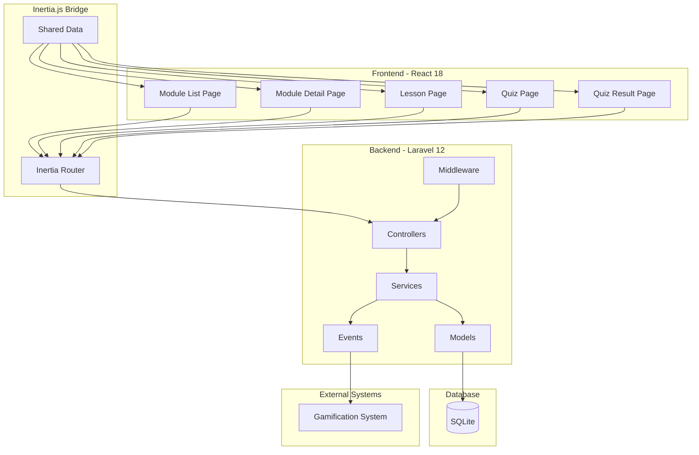
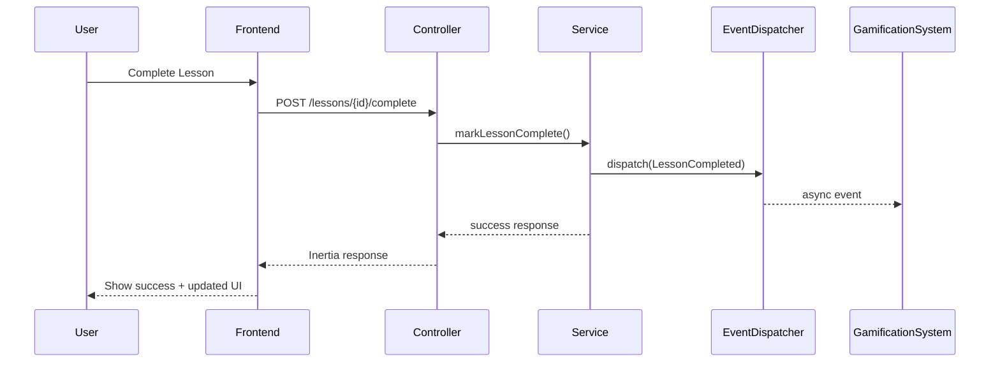

# Design Document: Murid Pembelajaran

## Overview

Fitur Murid Pembelajaran diimplementasikan menggunakan arsitektur Laravel 12 (backend) + React 18 (frontend) + Inertia.js (bridge) dengan pola MVC di backend dan component-based architecture di frontend. Sistem ini dirancang untuk memberikan pengalaman pembelajaran interaktif dengan progress tracking yang real-time dan terintegrasi dengan sistem gamifikasi melalui event-driven architecture.

**Stack Teknologi:**
- Backend: Laravel 12 (PHP 8.3+)
- Frontend: React 18 dengan TypeScript
- Bridge: Inertia.js v2
- Database: SQLite (development)
- State Management: React hooks (useState, useContext)
- Styling: Tailwind CSS (asumsi berdasarkan modern Laravel stack)

## Architecture

### High-Level Architecture



### Request Flow

1. **User Request** → Inertia.js menangkap navigasi
2. **Inertia Request** → Dikirim ke Laravel controller sebagai XHR
3. **Middleware Check** → RoleMiddleware dan SubscriptionMiddleware memvalidasi akses
4. **Controller** → Memanggil service layer untuk business logic
5. **Service Layer** → Berinteraksi dengan models dan dispatch events
6. **Inertia Response** → Controller mengembalikan Inertia response dengan data
7. **React Render** → Inertia.js merender React component dengan data baru

### Event-Driven Integration



## Components and Interfaces

### Backend Components

#### 1. Controllers

**ModuleController**
```php
class ModuleController extends Controller
{
    public function __construct(
        private ModuleService $moduleService
    ) {}
    
    // GET /modules
    public function index(Request $request): Response
    {
        // Mendapatkan user dari auth
        // Memanggil moduleService->getAccessibleModules()
        // Return Inertia::render('Modules/Index', [...])
    }
    
    // GET /modules/{id}
    public function show(int $id): Response
    {
        // Memanggil moduleService->getModuleWithLessons()
        // Return Inertia::render('Modules/Show', [...])
    }
}
```

**LessonController**
```php
class LessonController extends Controller
{
    public function __construct(
        private LessonService $lessonService
    ) {}
    
    // GET /lessons/{id}
    public function show(int $id): Response
    {
        // Memanggil lessonService->getLessonWithProgress()
        // Return Inertia::render('Lessons/Show', [...])
    }
    
    // POST /lessons/{id}/complete
    public function complete(int $id): RedirectResponse
    {
        // Memanggil lessonService->markAsComplete()
        // Redirect back dengan success message
    }
}
```

**QuizController**
```php
class QuizController extends Controller
{
    public function __construct(
        private QuizService $quizService
    ) {}
    
    // GET /quizzes/{id}
    public function show(int $id): Response
    {
        // Memanggil quizService->getQuizWithQuestions()
        // Return Inertia::render('Quizzes/Show', [...])
    }
    
    // POST /quizzes/{id}/submit
    public function submit(int $id, SubmitQuizRequest $request): Response
    {
        // Memanggil quizService->submitQuiz()
        // Return Inertia::render('Quizzes/Result', [...])
    }
}
```

#### 2. Services

**ModuleService**
```php
class ModuleService
{
    public function __construct(
        private Module $moduleModel,
        private Progress $progressModel
    ) {}
    
    public function getAccessibleModules(User $user, ?string $levelFilter = null): Collection
    {
        // Mendapatkan levels yang accessible berdasarkan subscription
        // Query modules dengan filter level
        // Menghitung progress untuk setiap module
        // Menentukan status (locked/unlocked/completed)
        // Return collection of modules dengan metadata
    }
    
    public function getModuleWithLessons(int $moduleId, User $user): array
    {
        // Mendapatkan module dengan lessons
        // Menghitung progress module
        // Menentukan status setiap lesson
        // Return array dengan module data dan lessons
    }
    
    public function calculateModuleProgress(int $moduleId, int $userId): float
    {
        // Menghitung jumlah lessons dalam module
        // Menghitung jumlah lessons completed oleh user
        // Return percentage (0-100)
    }
    
    public function isModuleUnlocked(Module $module, User $user): bool
    {
        // Cek apakah module adalah yang pertama di level (auto unlocked)
        // Cek apakah module sebelumnya sudah completed
        // Return boolean
    }
}
```

**LessonService**
```php
class LessonService
{
    public function __construct(
        private Lesson $lessonModel,
        private Progress $progressModel
    ) {}
    
    public function getLessonWithProgress(int $lessonId, User $user): array
    {
        // Mendapatkan lesson dengan module info
        // Mendapatkan progress user untuk lesson ini
        // Mendapatkan previous dan next lesson
        // Return array dengan lesson data dan metadata
    }
    
    public function markAsComplete(int $lessonId, User $user, ?float $score = null): Progress
    {
        // Membuat atau update progress record
        // Dispatch LessonCompleted event
        // Return progress model
    }
    
    public function isLessonUnlocked(Lesson $lesson, User $user): bool
    {
        // Cek apakah lesson adalah yang pertama di module (auto unlocked)
        // Cek apakah lesson sebelumnya sudah completed
        // Return boolean
    }
}
```

**QuizService**
```php
class QuizService
{
    public function __construct(
        private Quiz $quizModel,
        private Question $questionModel,
        private Attempt $attemptModel
    ) {}
    
    public function getQuizWithQuestions(int $quizId): array
    {
        // Mendapatkan quiz dengan questions
        // Shuffle options untuk multiple choice (optional)
        // Return array dengan quiz data
    }
    
    public function submitQuiz(int $quizId, User $user, array $answers): array
    {
        // Mendapatkan questions dengan correct answers
        // Validasi setiap answer
        // Menghitung score
        // Menghitung XP earned
        // Menyimpan attempt
        // Dispatch QuizCompleted event
        // Return result array dengan score, xp, breakdown
    }
    
    public function validateAnswer(Question $question, string $userAnswer): bool
    {
        // Untuk multiple choice: exact match
        // Untuk typing/listening: case-insensitive, trimmed match
        // Return boolean
    }
    
    public function calculateXP(float $score, int $totalQuestions): int
    {
        // Formula: (score / totalQuestions) * 100 * 10
        // Return XP sebagai integer
    }
}
```

#### 3. Models

**Module Model**
```php
class Module extends Model
{
    protected $fillable = ['level_id', 'title', 'week_number', 'description'];
    
    public function level(): BelongsTo
    {
        return $this->belongsTo(Level::class);
    }
    
    public function lessons(): HasMany
    {
        return $this->hasMany(Lesson::class)->orderBy('order');
    }
    
    public function progress(): HasManyThrough
    {
        return $this->hasManyThrough(Progress::class, Lesson::class);
    }
}
```

**Lesson Model**
```php
class Lesson extends Model
{
    protected $fillable = ['module_id', 'title', 'content', 'order'];
    protected $casts = ['content' => 'array'];
    
    public function module(): BelongsTo
    {
        return $this->belongsTo(Module::class);
    }
    
    public function quiz(): HasOne
    {
        return $this->hasOne(Quiz::class);
    }
    
    public function progress(): HasMany
    {
        return $this->hasMany(Progress::class);
    }
    
    public function userProgress(int $userId): ?Progress
    {
        return $this->progress()->where('user_id', $userId)->first();
    }
}
```

**Quiz Model**
```php
class Quiz extends Model
{
    protected $fillable = ['lesson_id', 'type', 'time_limit'];
    
    public function lesson(): BelongsTo
    {
        return $this->belongsTo(Lesson::class);
    }
    
    public function questions(): HasMany
    {
        return $this->hasMany(Question::class);
    }
    
    public function attempts(): HasMany
    {
        return $this->hasMany(Attempt::class);
    }
}
```

**Question Model**
```php
class Question extends Model
{
    protected $fillable = [
        'quiz_id', 'question_text', 'options', 
        'correct_answer', 'explanation', 'audio_url'
    ];
    protected $casts = ['options' => 'array'];
    
    public function quiz(): BelongsTo
    {
        return $this->belongsTo(Quiz::class);
    }
}
```

**Progress Model**
```php
class Progress extends Model
{
    protected $fillable = ['user_id', 'lesson_id', 'completed_at', 'score'];
    protected $casts = ['completed_at' => 'datetime'];
    
    public function user(): BelongsTo
    {
        return $this->belongsTo(User::class);
    }
    
    public function lesson(): BelongsTo
    {
        return $this->belongsTo(Lesson::class);
    }
}
```

**Attempt Model**
```php
class Attempt extends Model
{
    protected $fillable = ['user_id', 'quiz_id', 'score', 'xp_earned', 'attempted_at'];
    protected $casts = ['attempted_at' => 'datetime'];
    
    public function user(): BelongsTo
    {
        return $this->belongsTo(User::class);
    }
    
    public function quiz(): BelongsTo
    {
        return $this->belongsTo(Quiz::class);
    }
}
```

#### 4. Events

**LessonCompleted Event**
```php
class LessonCompleted implements ShouldQueue
{
    use Dispatchable, InteractsWithQueue, SerializesModels;
    
    public function __construct(
        public User $user,
        public Lesson $lesson,
        public Progress $progress
    ) {}
}
```

**QuizCompleted Event**
```php
class QuizCompleted implements ShouldQueue
{
    use Dispatchable, InteractsWithQueue, SerializesModels;
    
    public function __construct(
        public User $user,
        public Quiz $quiz,
        public Attempt $attempt
    ) {}
}
```

#### 5. Middleware

**SubscriptionMiddleware**
```php
class SubscriptionMiddleware
{
    public function handle(Request $request, Closure $next): Response
    {
        // Mendapatkan user dari auth
        // Mendapatkan level yang diakses dari route parameter atau query
        // Jika free user dan level bukan N3, reject dengan 403
        // Jika premium user atau level N3, lanjutkan
        // Return response atau next($request)
    }
}
```

**RoleMiddleware** (sudah ada di Laravel, tinggal konfigurasi)
```php
// Di routes/web.php
Route::middleware(['auth', 'role:student'])->group(function () {
    // Routes untuk murid pembelajaran
});
```

### Frontend Components

#### 1. Pages

**Modules/Index.tsx**
```typescript
interface ModulesIndexProps {
    levels: Level[];
    modules: Module[];
    userSubscription: 'free' | 'premium';
}

export default function ModulesIndex({ levels, modules, userSubscription }: ModulesIndexProps) {
    const [selectedLevel, setSelectedLevel] = useState<string>('N3');
    const [searchQuery, setSearchQuery] = useState<string>('');
    
    // Filter modules berdasarkan level dan search
    // Render level tabs
    // Render module cards dengan progress indicator
    // Handle click module card -> navigate ke detail
}
```

**Modules/Show.tsx**
```typescript
interface ModuleShowProps {
    module: Module;
    lessons: LessonWithStatus[];
    progress: number;
}

export default function ModuleShow({ module, lessons, progress }: ModuleShowProps) {
    // Render module header dengan progress bar
    // Render lessons list (accordion atau cards)
    // Handle click lesson -> navigate ke lesson page
    // Tampilkan status dan tombol sesuai lesson status
}
```

**Lessons/Show.tsx**
```typescript
interface LessonShowProps {
    lesson: Lesson;
    module: Module;
    previousLesson: Lesson | null;
    nextLesson: Lesson | null;
    progress: Progress | null;
}

export default function LessonShow({ lesson, module, previousLesson, nextLesson, progress }: LessonShowProps) {
    // Render progress bar (lesson position dalam module)
    // Render lesson content (text, images, audio)
    // Render navigation buttons (prev/next)
    // Render Take Quiz button
    // Handle mark as complete
}
```

**Quizzes/Show.tsx**
```typescript
interface QuizShowProps {
    quiz: Quiz;
    questions: Question[];
    lesson: Lesson;
}

export default function QuizShow({ quiz, questions, lesson }: QuizShowProps) {
    const [currentQuestionIndex, setCurrentQuestionIndex] = useState<number>(0);
    const [answers, setAnswers] = useState<Record<number, string>>({});
    const [timeRemaining, setTimeRemaining] = useState<number | null>(quiz.time_limit);
    
    // Render progress indicator
    // Render current question berdasarkan type
    // Handle answer selection/input
    // Handle timer countdown
    // Handle submit quiz
}
```

**Quizzes/Result.tsx**
```typescript
interface QuizResultProps {
    quiz: Quiz;
    attempt: Attempt;
    breakdown: QuestionResult[];
    nextLesson: Lesson | null;
}

export default function QuizResult({ quiz, attempt, breakdown, nextLesson }: QuizResultProps) {
    // Render score dan XP earned
    // Render breakdown per question (correct/incorrect)
    // Render explanation untuk setiap question
    // Render Retry dan Next Lesson buttons
}
```

#### 2. Shared Components

**ModuleCard.tsx**
```typescript
interface ModuleCardProps {
    module: Module;
    progress: number;
    status: 'locked' | 'unlocked' | 'completed';
    onClick: () => void;
}

export default function ModuleCard({ module, progress, status, onClick }: ModuleCardProps) {
    // Render card dengan title, week, description
    // Render progress bar
    // Render status badge/icon
    // Handle click (disabled jika locked)
}
```

**LessonItem.tsx**
```typescript
interface LessonItemProps {
    lesson: Lesson;
    status: 'locked' | 'unlocked' | 'in_progress' | 'completed';
    onStart: () => void;
    onContinue: () => void;
}

export default function LessonItem({ lesson, status, onStart, onContinue }: LessonItemProps) {
    // Render lesson info (title, duration, XP)
    // Render status icon
    // Render appropriate button (Start/Continue/Completed)
}
```

**QuestionRenderer.tsx**
```typescript
interface QuestionRendererProps {
    question: Question;
    type: 'multiple_choice' | 'typing' | 'listening';
    value: string;
    onChange: (value: string) => void;
    disabled?: boolean;
}

export default function QuestionRenderer({ question, type, value, onChange, disabled }: QuestionRendererProps) {
    // Render question berdasarkan type
    // Multiple choice: radio buttons
    // Typing: text input
    // Listening: audio player + text input
}
```

**ProgressBar.tsx**
```typescript
interface ProgressBarProps {
    current: number;
    total: number;
    showPercentage?: boolean;
}

export default function ProgressBar({ current, total, showPercentage }: ProgressBarProps) {
    // Render progress bar dengan percentage
    // Styling dengan Tailwind
}
```

## Data Models

### Database Schema (Existing)

```sql
-- users table
CREATE TABLE users (
    id INTEGER PRIMARY KEY,
    name TEXT NOT NULL,
    email TEXT UNIQUE NOT NULL,
    password TEXT NOT NULL,
    role TEXT NOT NULL, -- 'student', 'teacher', 'admin'
    subscription_status TEXT NOT NULL, -- 'free', 'premium'
    xp INTEGER DEFAULT 0,
    level INTEGER DEFAULT 1,
    streak_count INTEGER DEFAULT 0,
    last_activity_date DATE,
    created_at TIMESTAMP,
    updated_at TIMESTAMP
);

-- levels table
CREATE TABLE levels (
    id INTEGER PRIMARY KEY,
    level_name TEXT NOT NULL, -- 'N5', 'N4', 'N3', 'N2', 'N1'
    stage INTEGER NOT NULL,
    created_at TIMESTAMP,
    updated_at TIMESTAMP
);

-- modules table
CREATE TABLE modules (
    id INTEGER PRIMARY KEY,
    level_id INTEGER NOT NULL,
    title TEXT NOT NULL,
    week_number INTEGER NOT NULL,
    description TEXT,
    created_at TIMESTAMP,
    updated_at TIMESTAMP,
    FOREIGN KEY (level_id) REFERENCES levels(id)
);

-- lessons table
CREATE TABLE lessons (
    id INTEGER PRIMARY KEY,
    module_id INTEGER NOT NULL,
    title TEXT NOT NULL,
    content TEXT NOT NULL, -- JSON format
    order INTEGER NOT NULL,
    created_at TIMESTAMP,
    updated_at TIMESTAMP,
    FOREIGN KEY (module_id) REFERENCES modules(id)
);

-- quizzes table
CREATE TABLE quizzes (
    id INTEGER PRIMARY KEY,
    lesson_id INTEGER NOT NULL,
    type TEXT NOT NULL, -- 'multiple_choice', 'typing', 'listening'
    time_limit INTEGER, -- in seconds, nullable
    created_at TIMESTAMP,
    updated_at TIMESTAMP,
    FOREIGN KEY (lesson_id) REFERENCES lessons(id)
);

-- questions table
CREATE TABLE questions (
    id INTEGER PRIMARY KEY,
    quiz_id INTEGER NOT NULL,
    question_text TEXT NOT NULL,
    options TEXT, -- JSON array for multiple choice
    correct_answer TEXT NOT NULL,
    explanation TEXT,
    audio_url TEXT, -- for listening type
    created_at TIMESTAMP,
    updated_at TIMESTAMP,
    FOREIGN KEY (quiz_id) REFERENCES quizzes(id)
);

-- attempts table
CREATE TABLE attempts (
    id INTEGER PRIMARY KEY,
    user_id INTEGER NOT NULL,
    quiz_id INTEGER NOT NULL,
    score REAL NOT NULL,
    xp_earned INTEGER NOT NULL,
    attempted_at TIMESTAMP NOT NULL,
    created_at TIMESTAMP,
    updated_at TIMESTAMP,
    FOREIGN KEY (user_id) REFERENCES users(id),
    FOREIGN KEY (quiz_id) REFERENCES quizzes(id)
);

-- progress table
CREATE TABLE progress (
    id INTEGER PRIMARY KEY,
    user_id INTEGER NOT NULL,
    lesson_id INTEGER NOT NULL,
    completed_at TIMESTAMP,
    score REAL,
    created_at TIMESTAMP,
    updated_at TIMESTAMP,
    UNIQUE(user_id, lesson_id),
    FOREIGN KEY (user_id) REFERENCES users(id),
    FOREIGN KEY (lesson_id) REFERENCES lessons(id)
);
```

### Data Transfer Objects (DTOs)

**ModuleWithProgress**
```typescript
interface ModuleWithProgress {
    id: number;
    title: string;
    week_number: number;
    description: string;
    level: {
        id: number;
        level_name: string;
    };
    progress: number; // 0-100
    status: 'locked' | 'unlocked' | 'completed';
    total_lessons: number;
    completed_lessons: number;
}
```

**LessonWithStatus**
```typescript
interface LessonWithStatus {
    id: number;
    title: string;
    order: number;
    duration_estimate: number; // in minutes
    xp_estimate: number;
    status: 'locked' | 'unlocked' | 'in_progress' | 'completed';
    completed_at: string | null;
    score: number | null;
}
```

**QuizResult**
```typescript
interface QuizResult {
    quiz_id: number;
    score: number;
    xp_earned: number;
    total_questions: number;
    correct_answers: number;
    incorrect_answers: number;
    breakdown: QuestionResult[];
}

interface QuestionResult {
    question_id: number;
    question_text: string;
    user_answer: string;
    correct_answer: string;
    is_correct: boolean;
    explanation: string;
}
```


## Correctness Properties

*Property adalah karakteristik atau perilaku yang harus berlaku untuk semua eksekusi sistem yang valid - pada dasarnya, pernyataan formal tentang apa yang seharusnya dilakukan sistem. Properties berfungsi sebagai jembatan antara spesifikasi yang dapat dibaca manusia dan jaminan kebenaran yang dapat diverifikasi mesin.*

### Property 1: Subscription-Based Level Access Control

*For any* user dan level, sistem harus mengizinkan akses jika dan hanya jika: (1) user adalah premium, atau (2) user adalah free dan level adalah N3. Untuk akses yang ditolak, sistem harus mengembalikan error 403 dengan pesan upgrade subscription.

**Validates: Requirements 1.1, 1.2, 1.3, 1.4**

### Property 2: Module List Filtering by Level

*For any* level yang dipilih, sistem harus mengembalikan hanya modules yang memiliki level_id sesuai dengan level tersebut.

**Validates: Requirements 2.2**

### Property 3: Module Card Rendering Completeness

*For any* module card yang dirender, output harus mengandung title, week_number, description, dan progress indicator.

**Validates: Requirements 2.3**

### Property 4: Search Filter Accuracy

*For any* search query dan collection of modules, hasil yang dikembalikan harus hanya berisi modules yang title atau description-nya mengandung search query (case-insensitive).

**Validates: Requirements 2.4**

### Property 5: Module Status Determination

*For any* module, status harus ditentukan sebagai: (1) locked jika module sebelumnya belum completed, (2) completed jika semua lessons dalam module completed, (3) unlocked otherwise. Module pertama dalam level selalu unlocked.

**Validates: Requirements 2.5, 3.1, 3.2, 3.3, 3.4**

### Property 6: Module Detail Rendering Completeness

*For any* module detail page, response harus mengandung module header dengan title, description, progress percentage, dan daftar lessons dengan title, order, duration_estimate, xp_estimate, dan status.

**Validates: Requirements 4.1, 4.2**

### Property 7: Lesson Status Determination

*For any* lesson dalam module, status harus ditentukan sebagai: (1) locked jika lesson sebelumnya belum completed, (2) completed jika progress record exists dengan completed_at, (3) in_progress jika progress exists tanpa completed_at, (4) unlocked otherwise. Lesson pertama dalam module selalu unlocked atau in_progress atau completed.

**Validates: Requirements 4.3, 4.4, 4.5, 4.6**

### Property 8: Lesson Progress Bar Calculation

*For any* lesson dalam module, progress bar position harus dihitung sebagai (lesson.order - 1) / total_lessons_in_module * 100.

**Validates: Requirements 5.1**

### Property 9: Lesson Content Rendering

*For any* lesson content yang mengandung text, images, atau audio, sistem harus merender semua elements sesuai dengan format yang ditentukan dalam content JSON.

**Validates: Requirements 5.2**

### Property 10: Lesson Navigation

*For any* lesson, tombol Previous harus mengarah ke lesson dengan order = current_order - 1 jika exists, dan tombol Next harus mengarah ke lesson dengan order = current_order + 1 jika exists.

**Validates: Requirements 5.4, 5.5**

### Property 11: Lesson Completion Persistence

*For any* lesson yang di-mark as complete, sistem harus menyimpan atau update progress record dengan user_id, lesson_id, completed_at timestamp, dan optional score.

**Validates: Requirements 5.7, 11.1**

### Property 12: Multiple Choice Quiz Rendering

*For any* quiz dengan type multiple_choice, sistem harus menampilkan question_text dan exactly 4 options dari options JSON array.

**Validates: Requirements 6.1**

### Property 13: Quiz Answer Validation

*For any* quiz submission, sistem harus memvalidasi setiap answer dengan correct_answer. Untuk multiple choice, validasi exact match. Untuk typing dan listening, validasi case-insensitive dan trimmed match. Hasil validasi harus menandai setiap question sebagai correct atau incorrect.

**Validates: Requirements 6.3, 6.4, 6.5, 7.3**

### Property 14: Typing Quiz Rendering

*For any* quiz dengan type typing, sistem harus menampilkan question_text dan text input field.

**Validates: Requirements 7.1**

### Property 15: Listening Quiz Rendering

*For any* quiz dengan type listening, sistem harus menampilkan audio player dengan audio_url, question_text, dan text input field.

**Validates: Requirements 8.1, 8.3**

### Property 16: Quiz Timer Display

*For any* quiz, sistem harus menampilkan countdown timer jika dan hanya jika quiz memiliki time_limit yang tidak null.

**Validates: Requirements 9.1, 9.3**

### Property 17: Quiz Auto-Submit on Timeout

*For any* quiz dengan time_limit, ketika timer mencapai 0, sistem harus otomatis submit quiz dengan answers yang sudah diisi.

**Validates: Requirements 9.2**

### Property 18: Quiz Score Calculation

*For any* quiz submission, score harus dihitung sebagai (jumlah correct answers / total questions) * 100.

**Validates: Requirements 10.1**

### Property 19: Quiz Result Rendering Completeness

*For any* quiz result page, response harus mengandung total score, XP earned, breakdown correct/incorrect per question, dan explanation untuk setiap question.

**Validates: Requirements 10.2, 10.3**

### Property 20: Quiz Retry Functionality

*For any* quiz yang di-retry, sistem harus menampilkan quiz yang sama dengan questions yang sama dalam order yang sama.

**Validates: Requirements 10.5**

### Property 21: Quiz Result Navigation

*For any* quiz result page, tombol Next Lesson harus mengarah ke lesson berikutnya dalam module jika exists, atau ke module berikutnya jika current lesson adalah yang terakhir.

**Validates: Requirements 10.6**

### Property 22: Completed Lesson Status Display

*For any* lesson yang memiliki progress record dengan completed_at, sistem harus menampilkan status completed ketika lesson diakses.

**Validates: Requirements 11.2**

### Property 23: Module Progress Calculation

*For any* module, progress percentage harus dihitung sebagai (jumlah lessons dengan progress.completed_at / total lessons dalam module) * 100, dengan hasil 0% jika tidak ada lesson completed dan 100% jika semua completed.

**Validates: Requirements 11.3, 11.4, 16.1, 16.2, 16.3, 16.4**

### Property 24: Quiz Attempt Persistence

*For any* quiz submission, sistem harus menyimpan attempt record dengan user_id, quiz_id, score, xp_earned, dan attempted_at. Untuk retry, sistem harus menyimpan attempt baru tanpa menghapus attempts sebelumnya.

**Validates: Requirements 12.1, 12.3, 12.4**

### Property 25: XP Calculation from Quiz Score

*For any* quiz attempt, XP earned harus dihitung berdasarkan formula: (score / 100) * total_questions * 10.

**Validates: Requirements 12.2**

### Property 26: Lesson Completion Event Dispatch

*For any* lesson yang diselesaikan, sistem harus dispatch LessonCompleted event dengan user_id dan lesson_id secara asynchronous (queued).

**Validates: Requirements 13.1, 13.4**

### Property 27: Quiz Completion Event Dispatch

*For any* quiz yang diselesaikan, sistem harus dispatch QuizCompleted event dengan user_id, quiz_id, score, dan xp_earned secara asynchronous (queued).

**Validates: Requirements 13.2, 13.4**

### Property 28: Role-Based Authorization

*For any* endpoint pembelajaran, sistem harus memverifikasi bahwa authenticated user memiliki role 'student'. Jika tidak, sistem harus menolak akses dengan status 403 Forbidden.

**Validates: Requirements 14.1, 14.2**

### Property 29: Quiz Answer Non-Empty Validation

*For any* quiz submission, sistem harus memvalidasi bahwa setiap answer tidak kosong (not null, not empty string, not whitespace only). Jika validasi gagal, sistem harus mengembalikan error message yang deskriptif.

**Validates: Requirements 15.1, 15.4**

### Property 30: Resource ID Validation

*For any* request yang mengakses lesson, module, atau quiz, sistem harus memvalidasi bahwa ID yang diberikan exists dalam database. Jika tidak exists, sistem harus mengembalikan error 404 dengan message yang deskriptif.

**Validates: Requirements 15.2, 15.4**

### Property 31: Foreign Key Validation

*For any* operation yang menyimpan progress atau attempt, sistem harus memvalidasi bahwa user_id, lesson_id, dan quiz_id (jika applicable) adalah valid foreign keys yang exists. Jika validasi gagal, sistem harus mengembalikan error message yang deskriptif.

**Validates: Requirements 15.3, 15.4**

## Error Handling

### Error Categories

1. **Authentication Errors (401)**
   - User tidak authenticated
   - Token expired atau invalid

2. **Authorization Errors (403)**
   - User bukan student (role mismatch)
   - Free user mencoba akses level selain N3
   - User mencoba akses resource yang locked

3. **Validation Errors (422)**
   - Quiz answer kosong
   - Invalid input format
   - Missing required fields

4. **Not Found Errors (404)**
   - Module, lesson, atau quiz ID tidak exists
   - Resource tidak ditemukan

5. **Server Errors (500)**
   - Database connection failure
   - Event dispatch failure (logged, tidak blocking)

### Error Response Format

Semua error responses menggunakan format JSON konsisten:

```json
{
    "message": "Human-readable error message",
    "errors": {
        "field_name": ["Specific validation error"]
    }
}
```

### Error Handling Strategy

1. **Controller Level**: Catch validation exceptions, return 422 dengan error details
2. **Middleware Level**: Catch authorization exceptions, return 403 dengan message
3. **Service Level**: Throw domain-specific exceptions dengan context
4. **Event Dispatch**: Log errors tetapi tidak blocking main flow (fire-and-forget)

### Logging

- Semua errors di-log dengan level sesuai severity
- Authentication/Authorization errors: WARNING level
- Validation errors: INFO level
- Server errors: ERROR level dengan stack trace
- Event dispatch failures: ERROR level

## Testing Strategy

### Dual Testing Approach

Sistem ini menggunakan kombinasi unit testing dan property-based testing untuk memastikan correctness yang comprehensive:

- **Unit tests**: Memverifikasi contoh spesifik, edge cases, dan error conditions
- **Property tests**: Memverifikasi universal properties across all inputs
- Keduanya complementary dan necessary untuk coverage yang comprehensive

### Unit Testing

Unit tests fokus pada:

1. **Specific Examples**
   - Module pertama dalam level selalu unlocked
   - Quiz dengan 3 correct dari 5 questions = score 60
   - Free user akses N3 = allowed, akses N5 = forbidden

2. **Edge Cases**
   - Module tanpa lessons (progress = 0%)
   - Quiz tanpa questions (score = 0)
   - Lesson pertama dan terakhir dalam module (navigation buttons)
   - Empty search query (return all modules)

3. **Error Conditions**
   - Invalid module ID → 404
   - Non-student user → 403
   - Empty quiz answer → 422
   - Quiz submission dengan missing questions

4. **Integration Points**
   - Event dispatch ke gamification system
   - Middleware chain (auth → role → subscription)
   - Database transactions untuk progress/attempt

### Property-Based Testing

**Library**: Pest PHP dengan plugin pest-plugin-faker untuk Laravel

**Configuration**: Minimum 100 iterations per property test

**Test Tagging**: Setiap property test harus di-tag dengan format:
```php
test('property test name')
    ->tags(['feature:murid-pembelajaran', 'property:1'])
    ->repeat(100)
    ->...
```

**Properties to Test**:

Setiap correctness property (Property 1-31) harus diimplementasikan sebagai property-based test dengan:
- Random input generation (users, modules, lessons, quizzes)
- Universal assertion yang harus hold untuk all inputs
- Reference ke design document property number

**Example Property Test Structure**:

```php
// Feature: murid-pembelajaran, Property 1: Subscription-Based Level Access Control
test('free users can only access N3 level')
    ->tags(['feature:murid-pembelajaran', 'property:1'])
    ->repeat(100)
    ->expect(function () {
        $freeUser = User::factory()->create(['subscription_status' => 'free']);
        $restrictedLevels = ['N5', 'N4', 'N2', 'N1'];
        $randomLevel = $restrictedLevels[array_rand($restrictedLevels)];
        
        $response = actingAs($freeUser)->get("/modules?level={$randomLevel}");
        
        return $response->status() === 403;
    })
    ->toBeTrue();

// Feature: murid-pembelajaran, Property 23: Module Progress Calculation
test('module progress is calculated correctly')
    ->tags(['feature:murid-pembelajaran', 'property:23'])
    ->repeat(100)
    ->expect(function () {
        $user = User::factory()->create();
        $module = Module::factory()->hasLessons(rand(3, 10))->create();
        $lessons = $module->lessons;
        
        // Complete random number of lessons
        $completedCount = rand(0, $lessons->count());
        $lessons->take($completedCount)->each(function ($lesson) use ($user) {
            Progress::create([
                'user_id' => $user->id,
                'lesson_id' => $lesson->id,
                'completed_at' => now(),
            ]);
        });
        
        $expectedProgress = ($completedCount / $lessons->count()) * 100;
        $actualProgress = app(ModuleService::class)->calculateModuleProgress($module->id, $user->id);
        
        return abs($expectedProgress - $actualProgress) < 0.01; // floating point tolerance
    })
    ->toBeTrue();
```

### Test Coverage Goals

- Unit test coverage: minimum 80% untuk services dan controllers
- Property test coverage: 100% untuk semua correctness properties
- Integration test coverage: semua critical user flows (module → lesson → quiz → result)

### Testing Tools

- **PHPUnit/Pest**: Unit dan integration testing
- **Laravel Factories**: Generate test data
- **Laravel HTTP Tests**: Test Inertia responses
- **Mockery**: Mock external dependencies (gamification system)
- **Database Transactions**: Rollback setelah setiap test

### Continuous Integration

- Run all tests pada setiap commit
- Property tests run dengan seed yang berbeda untuk variability
- Fail build jika ada test yang gagal atau coverage drop
